# Definition

## Survey Elicitation Technique  
The **Survey Elicitation Technique** is a method of collecting structured input from stakeholders through carefully designed surveys.  
It is used to gather both:  

- **Functional requirements** (specific features or services users need)  
- **Non-functional requirements** (qualities such as trust, usability, and personalization)  

This technique helps in understanding user needs, expectations, and preferences, allowing for the mapping of these insights to system features.  

---

# Why We Used This Method

### Relevance to Target Users  
Since our platform (**AdvocAI**) is user-centric, we needed direct feedback from potential users.  

### Scalability  
A single Google Form could reach a large and diverse audience quickly.  

### Balanced Data Collection  
The form had closed-ended questions for quantitative analysis and open-ended questions for qualitative insights.  

### Ease of Participation  
Stakeholders could respond anytime and anonymously, encouraging more honest answers.  

### Efficient Requirement Gathering  
This allowed us to collect both functional requirements and non-functional requirements simultaneously.  

---

# Detailed Description of How We Did That

## Step 1: Preparation  
We defined the objectives of the survey:  
- To understand how users interact with legal documents  
- To identify their pain points  
- To capture the features they would like in **AdvocAI**  

## Step 2: Form Design  

### Legal Document Features  
- Difficulty in understanding legal documents  
- Usefulness of summarization  
- Types of documents: contracts, property, business, employment  

### Lawyer Connection Features  
- Preference for risk/highlight extraction  
- Interest in connecting to lawyers  
- Preferred modes of communication  
- Factors influencing lawyer choice  

### AI Summariser  
- Comfort level in using AI for legal queries  
- Types of lawyer assistance preferred  

### Feedback  
- Open-ended questions about challenges  
- Trust factors  
- Additional suggestions  

---

# Requirements for Sprint 1

## Functional Requirements (FRs) – Basic Scope  

### Document Upload & Summarization  
- Upload simple documents (contracts, property, HR docs)  
- Generate short summaries with only key points.

### Lawyer Connection & Consultation  
- Provide a basic option to connect with lawyers after AI summary  

### AI Summariser
- Answer basic legal definitions and FAQs  
- Provide step-by-step guidance for **very simple tasks** 

---

## Non-Functional Requirements (NFRs) – Basic Scope  

- **Accuracy & Reliability** – Deliver simple, reasonably correct outputs 
- **Security** – Basic file privacy
- **Usability** – Simple, user-friendly interface for first-time users  
- **Performance** – Quick summarization and chatbot responses for small documents  
- **Scalability** – Limited user support for testing (not full real-time availability yet)  
- **Trust** – Show clear, simple explanations and basic lawyer details (name, expertise)  

## User Stories 

# User Stories

| Front | Back (Acceptance Criteria) |
|-------|-----------------------------|
| **As a non professional user, I want** the facility to summarise general contracts and agreements, real estate and property related documents, business contracts, application forms and employment/HR documents **so that** I can easily understand them without wasting time going through them. | 1. User can upload contracts, real estate/property docs, business contracts, application forms and HR/employment docs. 2. System generates a concise summary in plain, jargon-free language. 3. File format should be Word or PDF. 4. Summary is generated within a reasonable time, say 5 minutes. 5. A disclaimer to further consult a lawyer before proceeding with AI’s understanding of the document. |
| **As a non professional user, I want** to be able to connect and communicate to a lawyer via chat service, audio or video call or email after generating the AI summary, **so that** I can feel secure about proceeding with the document. | 1. Users should be able to see an option to connect with a lawyer. 2. User can choose between multiple communication modes: &nbsp;&nbsp;&nbsp;• Chat service &nbsp;&nbsp;&nbsp;• Audio call &nbsp;&nbsp;&nbsp;• Video call &nbsp;&nbsp;&nbsp;• Email 3. System shows available lawyers before the user initiates contact. 4. Lawyer must request user’s permission to view the document if it is set to be viewed with access. If set as “anyone can view”, then the Lawyer can click on a user’s document to see it. 5. User receives confirmation that the lawyer has accepted or scheduled the session. |

# Survey Responses

We took a comprehensive survey via a Google Form, which was filled by **100+ participants**.  
The summary of the survey is presented below, with charts/graphs attached.

---

## Age Distribution
The survey was filled by people ranging from ages **17 to 58**, with maximum participants in the **19–20** and **53–56** age groups.

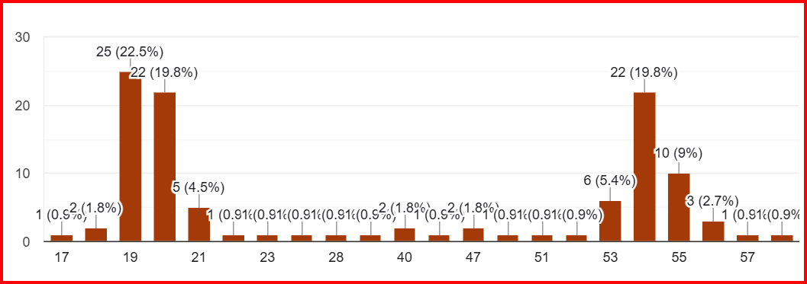

---

## Profession Split
There was a roughly even split between **working professionals** and **students**.  
(*Note: Both red and yellow in the chart represent working professionals – a spelling error caused duplication.*)

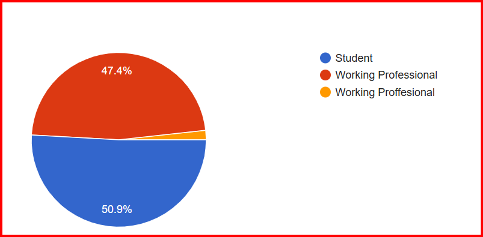

---

## Understanding Legal Documents
A **majority of participants** find it *somewhat difficult* to understand legal documents.

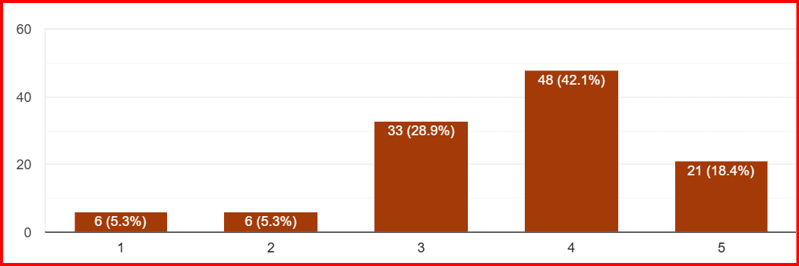

---

## Use of Online Legal Assistance Tools
Most people had **never used an online legal assistance tool**.

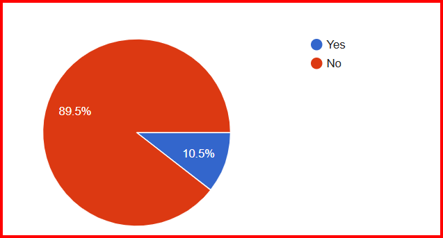

---

## Summarisation Feature
Most respondents felt that a **document summarisation feature** would be useful.

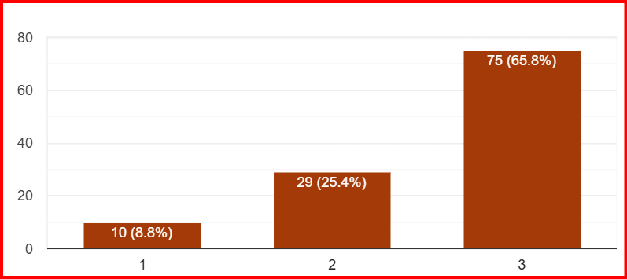

---

## Common Document Types
The majority of people deal with **Contracts & Agreements**.

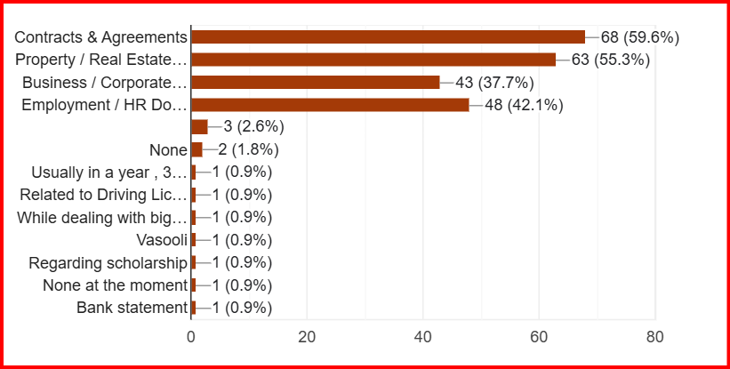

---

## AI Highlighting Feature
Most people were in favour of **AI that highlights risks, obligations, and key clauses**.  
No one was against it.

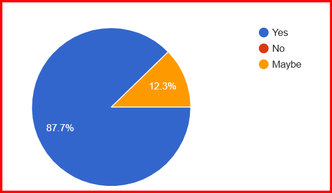

---

## Lawyer Connection Preferences
There was a **split opinion** on whether to connect directly with a lawyer after reviewing the AI summary.  
Many preferred an **audio call** to connect with the lawyer.

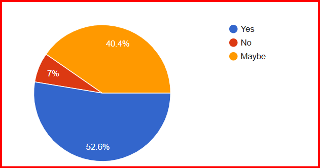

**Influencing factors** in choosing a lawyer:  
- Area of expertise  
- Years of experience  
- Fees  

---

## Personalised Dashboard
More than a quarter of people felt the need for a **dashboard** to track uploaded documents, summaries, and consultations.

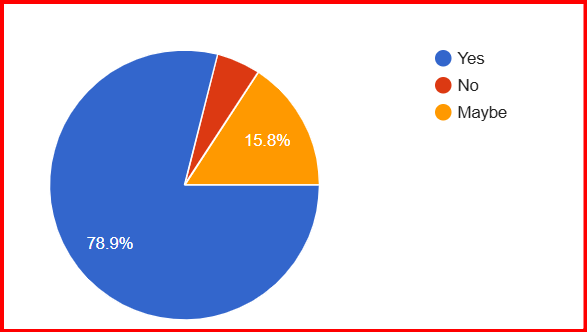

---

## Chatbot Usage
There was a **split opinion** on willingness to ask a **chatbot** for basic legal questions.

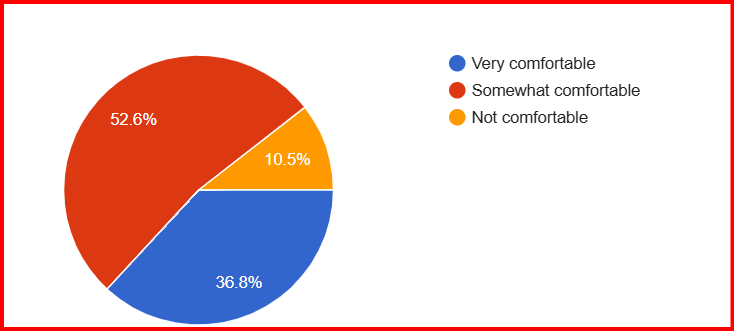

---

## Step-by-Step Assistance
Many felt that **step-by-step assistance for simple legal tasks** would be the most useful feature.

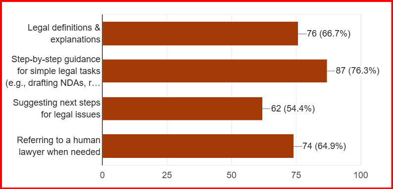

---

# Conclusion
The survey highlights the **demand for AI-driven tools** that simplify legal documents, provide actionable insights, and offer direct lawyer connectivity where needed.  
A combination of **AI-powered summarisation, clause highlighting, personalised dashboards, and step-by-step guidance** is likely to be the most impactful solution.
